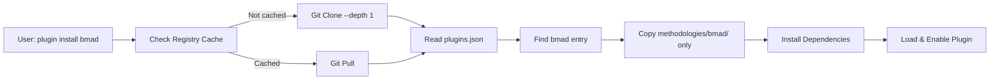

# Auto Claude Plugin Registry

This document describes the centralized plugin registry system for sharing and distributing Auto Claude plugins.

## Overview

The plugin registry provides a simple, git-based way to share plugins without requiring npm publishing or a complex marketplace infrastructure. Plugins are stored in a central monorepo, and users can selectively install individual plugins.

## Architecture

```
auto-claude-plugins/                    # Central registry (GitHub monorepo)
├── plugins.json                        # Plugin index
├── methodologies/                      # Methodology plugins
│   ├── bmad/
│   │   ├── package.json
│   │   ├── dist/
│   │   ├── src/
│   │   └── prompts/
│   └── github-speckit/
├── providers/                          # Provider plugins
│   ├── openai/
│   │   ├── package.json
│   │   ├── dist/
│   │   └── src/
│   └── anthropic/
└── integrations/                       # Integration plugins
    ├── github/
    └── linear/

user's project/
└── .auto-claude/
    └── plugins/                        # Installed plugins
        └── bmad/                       # Only copied plugin, not entire monorepo
            ├── package.json
            └── dist/
```

## Plugin Index Format

The `plugins.json` file serves as the central index for all available plugins:

```json
{
  "version": "1.0.0",
  "registry": "https://github.com/auto-claude/plugins",
  "lastUpdated": "2025-01-19T00:00:00Z",
  "plugins": [
    {
      "id": "bmad",
      "name": "BMAD Methodology",
      "type": "methodology",
      "path": "methodologies/bmad",
      "version": "1.0.0",
      "author": "Auto Claude",
      "description": "Brainstorming, Minimal Architecture, and Development methodology",
      "dependencies": [],
      "homepage": "https://github.com/auto-claude/plugins/tree/main/methodologies/bmad",
      "sizeBytes": 45000,
      "tags": ["methodology", "agile", "architecture"]
    },
    {
      "id": "openai",
      "name": "OpenAI Provider",
      "type": "provider",
      "path": "providers/openai",
      "version": "1.2.0",
      "author": "Auto Claude",
      "description": "OpenAI GPT models integration",
      "dependencies": [],
      "capabilities": {
        "types": ["llm", "embedding"],
        "streaming": true,
        "functionCalling": true
      },
      "tags": ["provider", "llm", "openai"]
    },
    {
      "id": "github",
      "name": "GitHub Integration",
      "type": "integration",
      "path": "integrations/github",
      "version": "2.0.0",
      "categories": ["vcs", "project"],
      "description": "GitHub repositories, issues, and PRs",
      "dependencies": ["@auto-claude/core-mcp"],
      "tags": ["integration", "github", "vcs"]
    }
  ]
}
```

## Installation Flow

When a user installs a plugin from the registry:

1. **Registry Cache**: The central registry is cloned (or updated) to a local cache
2. **Index Lookup**: The plugin is located in `plugins.json`
3. **Selective Copy**: Only the specific plugin folder is copied to the user's project
4. **Dependency Install**: Plugin dependencies are installed
5. **Plugin Load**: The plugin is loaded and enabled



## Selective Copy Implementation

The key benefit of this approach is that only the specific plugin folder is copied, not the entire monorepo:

```typescript
// Registry is cached in ~/.auto-claude/.registry-cache
// Only the specific plugin is copied to project's .auto-claude/plugins/

private async copyPluginFolder(source: string, target: string): Promise<void> {
  await fs.copy(source, target, {
    filter: (src) => {
      const relative = path.relative(source, src);
      // Skip unnecessary files during copy
      return !relative.startsWith('node_modules') &&
             !relative.startsWith('.git') &&
             !relative.startsWith('dist');
    }
  });
}
```

## CLI Commands

```bash
# List all available plugins
auto-claude plugin list

# List plugins by type
auto-claude plugin list --type methodology
auto-claude plugin list --type provider
auto-claude plugin list --type integration
auto-claude plugin list --type orchestration

# Search plugins by tag
auto-claude plugin search --tag github
auto-claude plugin search --tag llm

# Get detailed info about a plugin
auto-claude plugin info bmad

# Install a plugin from registry
auto-claude plugin install bmad

# Update the registry cache
auto-claude plugin update-registry

# Upgrade an installed plugin
auto-claude plugin upgrade bmad
```

## Plugin Structure

Each plugin in the registry follows the standard package structure:

```
methodologies/bmad/
├── package.json              # Plugin metadata
├── auto-claude.config.ts     # Plugin configuration
├── dist/
│   ├── index.js             # Compiled entry
│   ├── index.d.ts           # TypeScript types
│   └── plugin.js            # Plugin definition
├── src/
│   ├── index.ts
│   ├── plugin.ts
│   └── ui/
│       └── Settings.tsx
└── prompts/
    └── brainstorm.md        # Agent prompts
```

### package.json

```json
{
  "name": "@auto-claude/bmad",
  "version": "1.0.0",
  "type": "module",
  "main": "./dist/index.js",
  "types": "./dist/index.d.ts",
  "exports": {
    ".": "./dist/index.js",
    "./plugin": "./dist/plugin.js"
  },
  "auto-claude": {
    "id": "bmad",
    "type": "methodology",
    "version": "1.0.0"
  },
  "peerDependencies": {
    "@auto-claude/sdk": "^1.0.0"
  }
}
```

## Registry Cache Management

The registry is cached locally to avoid re-cloning on every operation:

```typescript
// Cache location
~/.auto-claude/.registry-cache/

// Initial clone: shallow, fast
git clone --depth 1 https://github.com/auto-claude/plugins ~/.auto-claude/.registry-cache

// Update: fast fetch
git pull origin main
```

### Sparse Checkout (Optional)

For very large registries, git sparse checkout can be used to only fetch needed files:

```bash
# Only fetch plugins.json initially
git config core.sparseCheckout true
echo "plugins.json" > .git/info/sparse-checkout

# When installing a plugin, add its path
echo "methodologies/bmad/*" >> .git/info/sparse-checkout
git checkout main
```

## Publishing a Plugin

To add a new plugin to the registry:

1. **Create Plugin Directory**: Add your plugin to the appropriate category folder
   ```bash
   mkdir -p methodologies/my-methodology
   ```

2. **Add Plugin Files**: Include all necessary files (package.json, dist/, src/, etc.)
   ```bash
   methodologies/my-methodology/
   ├── package.json
   ├── dist/
   └── src/
   ```

3. **Update Index**: Add entry to `plugins.json`
   ```json
   {
     "id": "my-methodology",
     "name": "My Custom Methodology",
     "type": "methodology",
     "path": "methodologies/my-methodology",
     "version": "1.0.0",
     "author": "Your Name",
     "description": "Description of your methodology",
     "dependencies": [],
     "tags": ["methodology", "custom"]
   }
   ```

4. **Submit PR**: Create a pull request to the registry repository

5. **Verification**: Maintainers verify the plugin before merging

## Plugin Types

### Methodology Plugins
Alter how Auto Claude builds software - spec creation, agent behavior, validation.

**Location**: `methodologies/`

**Examples**:
- BMAD - Brainstorming, Minimal Architecture, Development
- GitHub SpecKit - Spec creation from GitHub issues

### Provider Plugins
Add support for different LLM and embedding providers.

**Location**: `providers/`

**Examples**:
- OpenAI - GPT-4, GPT-4o, embeddings
- Anthropic - Claude models
- Google AI - Gemini models

### Integration Plugins
Connect external tools, services, and protocols.

**Location**: `integrations/`

**Examples**:
- GitHub - Repositories, issues, PRs
- Linear - Project management
- MCP Servers - Model Context Protocol

### Orchestration Plugins
Multi-agent frameworks and agent team management.

**Location**: `orchestration/`

**Examples**:
- CrewAI - Multi-agent orchestration
- AutoGen - Agent conversations

## Benefits

| Feature | Benefit |
|---------|---------|
| **Single Source** | All plugins in one discoverable location |
| **Selective Install** | Only copy needed plugin (~KB vs MB) |
| **Git-based** | No npm publishing required, uses existing infrastructure |
| **Fast Updates** | Shallow clone + git pull for quick updates |
| **Offline Capable** | Browse available plugins after initial cache |
| **Version Tracked** | Git history provides version tracking |
| **Community Friendly** | Easy PR workflow for contributions |

## Migration from npm

For existing npm-published plugins, they can be added to the registry without breaking existing installs:

```json
{
  "id": "my-plugin",
  "name": "My Plugin",
  "type": "methodology",
  "source": {
    "type": "npm",
    "package": "@my-org/my-plugin"
  }
}
```

The Plugin Manager can handle both registry and npm sources transparently.

## Security Considerations

1. **Code Review**: All plugins are reviewed via PR before merging
2. **Verified Authors**: Plugin authors are tracked in the index
3. **Sandboxing**: Plugins run within Auto Claude's security model
4. **Dependency Scanning**: Dependencies should be scanned for vulnerabilities

## Future Enhancements

Potential future features for the registry:

- **Signed Plugins**: Cryptographic signatures for verified plugins
- **Web Marketplace**: Browser-based plugin discovery
- **Usage Stats**: Track install counts and popularity
- **Reviews & Ratings**: Community feedback system
- **Auto-Updates**: Automatic plugin updates when new versions are released
- **Monetization**: Support for paid plugins
